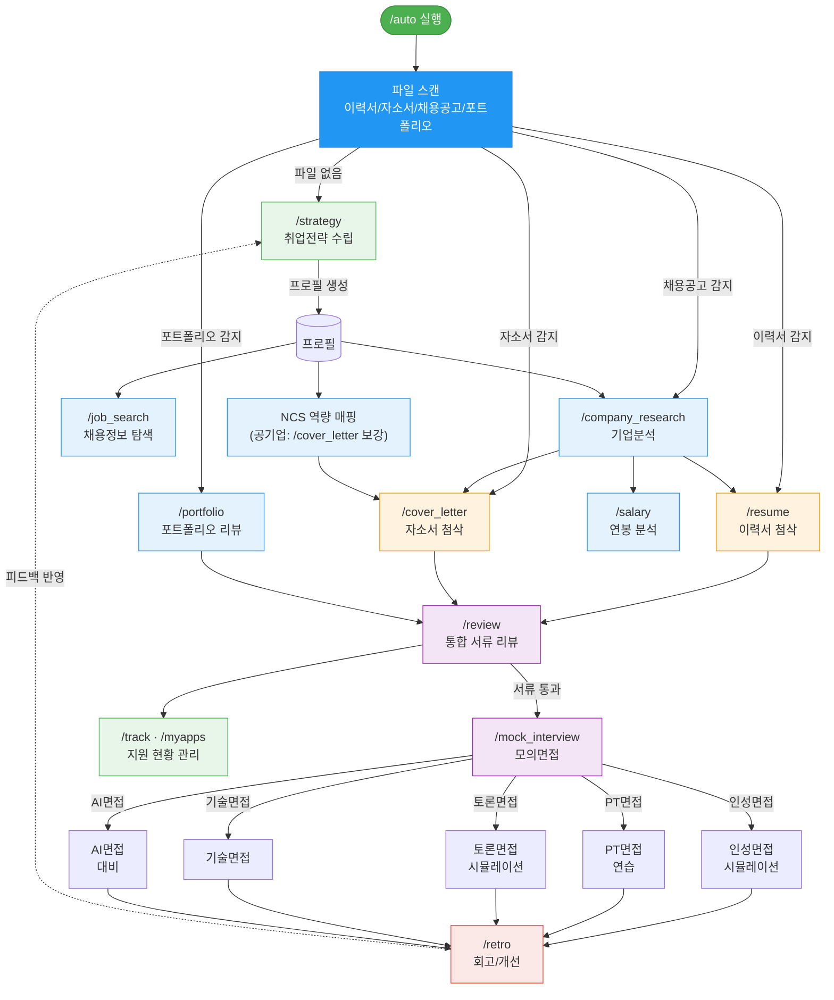
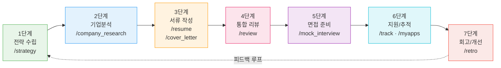
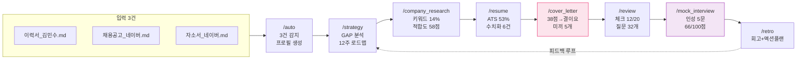

# jobstack

**한국 취업 통합 엑셀러레이터** — Claude Code 스킬 시스템

4년간 60건+ 자소서 첨삭에서 검증된 방법론을 AI 코칭으로 제공합니다.
기업분석부터 이력서, 자소서, 모의면접까지 취업 준비 전 과정을 통합 지원합니다.

---

## 핵심 철학

> **자소서는 일기장이 아니라 메뉴판이다.** 하소연이 아니라, 면접관이 맛보고 싶어하는 것을 차려놓아야 한다.

- **"결이요" 프레임워크** — 결론(5초) → 이유(수치) → 요청(비전)
- **미끼 전략** — 면접관이 물어보고 싶어할 포인트를 자소서에 배치하고 답변 준비
- **"이미 팀원처럼"** — 지원 팀의 제품/리뷰/업데이트를 분석하여 팀원처럼 대화
- **"바로 써보고 싶은 사람"** — 학생이 아닌, 당장 투입 가능한 실무자로 포지셔닝

---

## 전체 워크플로우



## 단계별 가이드



---

## 설치

```bash
git clone https://github.com/thesun4sky/jobstack.git
cd jobstack
./install.sh
```

설치 후 Claude Code에서 `/auto`를 입력하면 자동으로 시작됩니다.

---

## 결과물 뷰어

모든 스킬의 결과물은 Markdown으로 저장됩니다. 내장 뷰어로 브라우저에서 보기 좋게 확인할 수 있습니다:

```bash
jobstack-view 자소서-첨삭결과.md    # 브라우저에서 열기
jobstack-view 기업분석-삼성전자.md  # 스타일링된 HTML로 변환
```

- Noto Sans KR 한국어 최적화 타이포그래피
- 다크모드 자동 지원
- 테이블, 코드블록, 인용문 등 완벽 렌더링
- **"PDF 저장" 버튼**으로 즉시 PDF 변환 (브라우저 인쇄 기능)
- 모바일 반응형 지원

---

## 스킬 목록

| 스킬 | 설명 | Tier |
|------|------|------|
| `/auto` | 파일 자동 감지 + 단계별 가이드 (진입점) | 1 |
| `/strategy` | 역량 진단 + 취업전략 + 로드맵 생성 | 1 |
| `tracker/` (CLI 전용) | 지원 현황 추적 + 일정 관리 — 봇에서는 네이티브 `/track`·`/myapps` | 1 |
| `/company_research` | 7가지 키워드 소스 기업분석 + 적합도 스코어링 | 2 |
| `/job_search` | 사람인/잡코리아/원티드 채용공고 탐색 | 2 |
| `ncs/` (CLI 전용) | NCS 역량 매핑 + 경험→역량 변환 — 봇에서는 `/cover_letter`의 공기업 NCS 보강 | 2 |
| `/salary` | 연봉 벤치마크 + 협상 전략 | 2 |
| `/portfolio` | 포트폴리오 최적화 + 임팩트 표현 | 2 |
| `/retro` | 면접 회고 + 탈락 원인 분석 + 개선 | 2 |
| `/resume` | 이력서 작성/첨삭 + ATS 최적화 | 3 |
| `/cover_letter` | 자소서 작성/첨삭 ("결이요" + 5단계 첨삭) | 3 |
| `/mock_interview` | 모의면접 5가지 모드 (인성/PT/토론/AI/기술) | 4 |
| `/review` | 이력서↔자소서↔포트폴리오 통합 점검 | 4 |

> 명령 표기는 Telegram 봇 노출 기준(언더스코어)입니다. 스킬 디렉토리명은 하이픈을
> 유지합니다 (예: `company-research/`, `cover-letter/`, `mock-interview/`, `job-search/`).

---

## 사용 예시

### 초보자: `/auto`로 시작

이력서 파일이 있는 폴더에서 `/auto`를 실행하면:

```
╔══════════════════════════════════════════╗
║  jobstack 취업 준비 현황                   ║
╠══════════════════════════════════════════╣
║  [x] 프로필 — 이력서에서 자동 생성         ║
║  [x] 이력서 — resume.pdf 감지             ║
║  [ ] 이력서 첨삭 ← 추천 다음 단계          ║
║  [ ] 자기소개서                            ║
║  [ ] 모의면접                              ║
╚══════════════════════════════════════════╝
```

### 자소서 첨삭: 5단계 진단

```
자소서 진단 결과
━━━━━━━━━━━━━━━━━━━━━━━━━━━━━━━━
① 희망·의지형 종결어미    발견 [5건]  ⚠️
② 감정·감상 과다          발견 [3건]  ⚠️
③ 추상적 성과             발견 [4건]  ⚠️
④ 시간순 나열             발견       ⚠️
⑤ 기업 연구 부족          발견       ⚠️
━━━━━━━━━━━━━━━━━━━━━━━━━━━━━━━━
진단 점수: 40/100
```

### 기업 키워드 체크리스트

```
기업 키워드 체크리스트: 삼성전자 - SW엔지니어
━━━━━━━━━━━━━━━━━━━━━━━━━━━━━━━━━━
소스          키워드              반영
━━━━━━━━━━━━━━━━━━━━━━━━━━━━━━━━━━
채용공고      Python              O
채용공고      AWS                 X
CEO 신년사    AI 전환              O
인재상        도전정신             O
최신기사      반도체 투자확대       O
━━━━━━━━━━━━━━━━━━━━━━━━━━━━━━━━━━
반영률: 15/20 (75%) → 목표: 85%+
```

---

## 60건+ 첨삭 인사이트

jobstack은 4년간 60건 이상의 자소서 첨삭에서 추출된 실전 인사이트를 기반으로 합니다.

### 8대 원칙

1. **"바로 써보고 싶은 사람"** — 학습자가 아닌 즉시 투입 가능한 실무자
2. **"과장 없이, 그러나 강하게"** — 거짓 없이 임팩트 있게
3. **"5초 규칙"** — 첫 문장이 승부
4. **"수치가 없으면 성과가 아니다"** — before→after 필수
5. **"자소서는 설득 문서"** — 감정보다 논리
6. **"약점은 인정하되 역량을 보여줘라"**
7. **"기업 연구는 체계적으로"** — 7가지 소스 키워드 체크리스트
8. **"면접까지 일관된 스토리"** — 자소서 미끼 → 면접 답변

### 3가지 어조 전환 공식

| Before | After |
|--------|-------|
| "~하고 싶습니다" | "~하고 있습니다" |
| "흥미를 느꼈습니다" | 구체적 프로젝트/성과 서술 |
| "밤새 공부했습니다" | "XX% 성능 개선 달성" |

자세한 내용은 [ETHOS.md](ETHOS.md)를 참고하세요.

---

## E2E 통합 테스트

실제 샘플 데이터(이력서 + 자소서 + 채용공고)로 전체 8단계 플로우를 돌린 결과입니다.

> **페르소나**: 김민수 (신입 백엔드 개발자, 서울과기대 컴공, 인턴 6개월)
> **목표**: 네이버 서버 플랫폼 개발자

### 전체 플로우 요약



### 단계별 핵심 입출력

| Step | 스킬 | 입력 | 핵심 출력 | 크기 |
|------|------|------|----------|------|
| 1 | `/auto` | 폴더 파일 3건 | [대시보드](docs/e2e-output/step1-auto-대시보드.md) — 감지 결과 + 체크리스트 | 2.6KB |
| 2 | `/strategy` | 이력서 → 프로필 추출 | [프로필](docs/e2e-output/step2-strategy-프로필.yaml) + [로드맵](docs/e2e-output/step2-strategy-로드맵.md) | 8.5KB |
| 3 | `/company_research` | 채용공고 + WebSearch | [네이버 기업분석](docs/e2e-output/step3-company-research-네이버.md) — 키워드 반영률 14% | 9.8KB |
| 4 | `/resume` | 이력서 + 채용공고 | [이력서 첨삭](docs/e2e-output/step4-resume-첨삭결과.md) — 수치화 before/after 6건 | 13KB |
| 5 | `/cover_letter` | 자소서 + 기업분석 | [자소서 5단계 첨삭](docs/e2e-output/step5-cover-letter-첨삭결과.md) — 진단 38점, 미끼 5개 | **25.6KB** |
| 6 | `/review` | 이력서+자소서+채용공고 | [통합 점검](docs/e2e-output/step6-review-통합점검.md) — 면접 질문 32개 | 13.4KB |
| 7 | `/mock_interview` | 자소서 미끼 + 프로필 | [인성면접 5문](docs/e2e-output/step7-mock-interview-인성면접.md) — 66/100점 | 18.5KB |
| 8 | `tracker/` + `/retro` | 면접 결과 | [현황](docs/e2e-output/step8-tracker-현황.md) + [회고](docs/e2e-output/step8-retro-회고.md) | 11.5KB |
| | | | **총 출력** | **103KB** |

### 자소서 변환 추적 (Before → After)

**지원동기 원문**:
> "네이버는 대한민국을 대표하는 IT 기업이며...서버 개발에 **흥미를 느꼈고**...네이버에서 더 **성장하고 싶습니다**"

**결이요 적용 후**:
> "플러스테크 인턴 기간에 Redis 캐싱을 적용해 주요 API 응답시간을 **350ms에서 15ms로 단축**한 경험이 있습니다...네이버 **Search Platform이 일 수억 건의 검색 요청을 MSA 기반으로 처리**한다는...네이버 검색 백엔드의 응답 속도와 안정성 개선에 **즉시 기여하겠습니다**"

**전체 상세 리포트**: [docs/E2E-TEST-REPORT.md](docs/E2E-TEST-REPORT.md)

> 각 단계의 실제 출력물 전문은 [docs/e2e-output/](docs/e2e-output/) 디렉토리에서 확인할 수 있습니다.

---

## 아키텍처

[gstack](https://github.com/garrytan/gstack)의 아키텍처를 차용했습니다.

- **100% Markdown 스킬** — 코드 없이 프롬프트만으로 동작
- **YAML 프론트매터** — 스킬 메타데이터 정의
- **파일 기반 상태관리** — `~/.jobstack/`에 YAML/JSONL
- **로컬 사용 기록** — 스킬 사용 이벤트가 `~/.jobstack/analytics/`에 로컬 파일로만 기록됩니다 (네트워크 전송 없음, 문서 내용·개인정보 미포함 — [규격](docs/telemetry-events.md))
- **Zero 의존성** — bash만 있으면 설치/실행 가능
- **스킬 체이닝** — `benefits-from`으로 스킬 간 의존성 정의

```
jobstack/
├── auto/SKILL.md           # 자동 감지 (진입점)
├── strategy/SKILL.md       # 전략 수립
├── company-research/       # 기업분석
├── resume/                 # 이력서
├── cover-letter/           # 자소서
├── mock-interview/         # 모의면접
├── ...
├── bin/jobstack-config     # 설정 관리
├── templates/              # 공유 템플릿
└── install.sh              # 설치 스크립트
```

---

## 기여하기

기여를 환영합니다! [CONTRIBUTING.md](CONTRIBUTING.md)를 참고하세요.

## 라이선스

[MIT](LICENSE)
